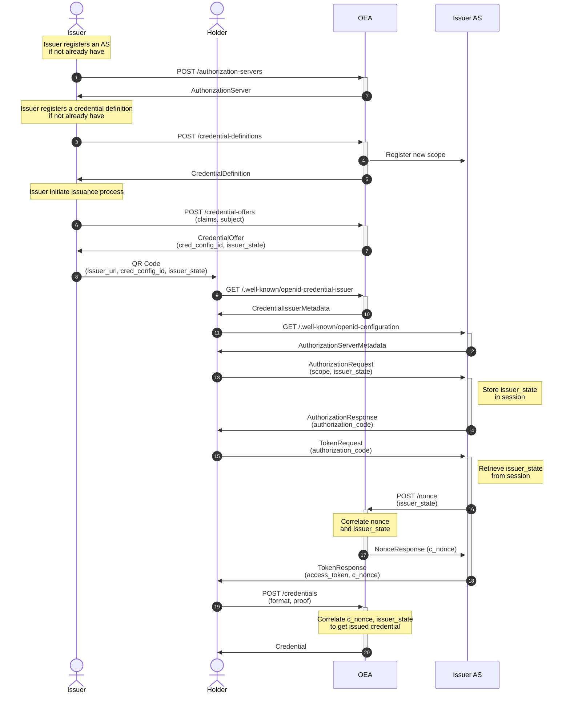

# Local setup

## Run OIDC4VC issuer services

```bash
cd examples/oidc4vc
docker-compose build
docker-compose up
```

Alice is a tenant in OEA acting as issuer.
Alice has an existing customer IAM and she wants to issue a VC for some of her users.

## Run python holder script

Make sure `python` is install together with these dependencies: `requests`

Then run the following command

```bash
python holder.py
```

# Sequence Diagram


